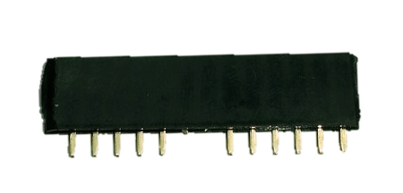

# Laser Beam Timer

Here's a handy little project that uses a little known feature of LEDs, and also has a laser in it, which makes it even cooler. We shine a Laser Module at the LED, and the LED actually generates a voltage depending on how much light is shining on it. We use an Arduino to measure this voltage, and if the beam is broken, then we can record the time to use it as a precise timer. You could use it like a race lap timer (for slot cars!), or to measure the speed of falling objects. Some soldering is required.

## Shopping List

|Qty| Code | Description |
|---|---|---|
|1 | [XC4410](http://jaycar.com.au/p/XC4410) | Uno main board
|1 | [XC4454](http://jaycar.com.au/p/XC4454) | LCD Button shield
|1 | [XC4490](http://jaycar.com.au/p/XC4490) | Laser Module
|1 | [XC4426](http://jaycar.com.au/p/XC4426) | IR LED transmitter
|1 | [HM3230](http://jaycar.com.au/p/HM3230) | Female header strip
|1 | [WC6028](http://jaycar.com.au/p/WC6028) | jumper leads

## Construction:

As the main parts are the Uno and a shield, there's not much construction involved. We soldered a female header strip onto the LCD Button Shield so that we can pull it all apart and reconfigure it later, but if you want something more permanent, you can solder the modules directly to the LCD Button Shield.

Take a piece of the header strip and carefully cut through the fourteenth pin from one end- this should leave thirteen complete pins. Then trim the sixth and seventh pins from one end. This should leave the header strip as per the picture.

This piece should slot into the power/analog side of the LCD Button shield, and can be soldered in place here.

The Laser Module is connected to 5V and GND, while the IR LED Transmitter module is connected to GND and A1 (A0 is taken by the buttons on the LCD Button Shield).

That completes the construction.

## Code:

The code is a single sketch file which only uses one library LiquidCrystal, which is included in the recent versions of the IDE. Simply select the correct board and serial port, and upload the sketch. If the screen says 'Lap Timer Ready', then the upload has worked.

## Usage:

An important part of the setup is aiming the laser and LED accurately so that the beam is detected properly. For this purpose, there is a calibration mode which can be entered by pressing the 'right' button. The top line shows the current analog reading on A1, while the lower line shows the current threshold for triggering.

A 'break' occurs when the analog value drops below the setpoint, and a 'make' occurs when the analog value goes back above the setpoint. To calibrate, align the laser and LED so that the analog value is as high as possible (laser aimed straight at the LED). Then break the beam with an opaque object, and see what the analog value changes to. The setpoint should be set to somewhere in between by pressing the 'up' and 'down' buttons. To return to normal operation, press the 'left' button.

There are three modes which can be selected by pressing the 'select' button. Lap mode counts the time between consecutive 'breaks'- like what would happen if the laser was set up as a lap timer on a racetrack. There is break mode, which counts the time for which the beam is broken- this is good for timing how long it takes an object to pass the beam. If you know how long an object is, then this can be used to work out speed. The last mode is make, which counts the time the beam is unbroken, like the opposite of break mode. The time is shown in milliseconds, and given that the Arduino takes much less than one millisecond to read an analog input, this will be fairly accurate.

## Improvements:

As noted above, the break mode is ideal for measuring speed if you know the length of an object as it passes the beam. Both this and the lap timer would make it an ideal accessory for a slot-car set. You could add some lap-counting and a second laser and sensor to turn it into a complete race computer, showing laps travelled, last lap time, total time and even speed on crossing the finish line.

* Although the output is given in seconds, converting the output to RPM would allow the Laser Beam Timer to be used as a tachometer.

Of course there is no reason that the input has to be an LED either. An LDR module could be used as well, although you wouldn't have the accuracy of a laser, and LDR's tend to have a slower response. You could use something like a reed switch activated by a passing magnet.
